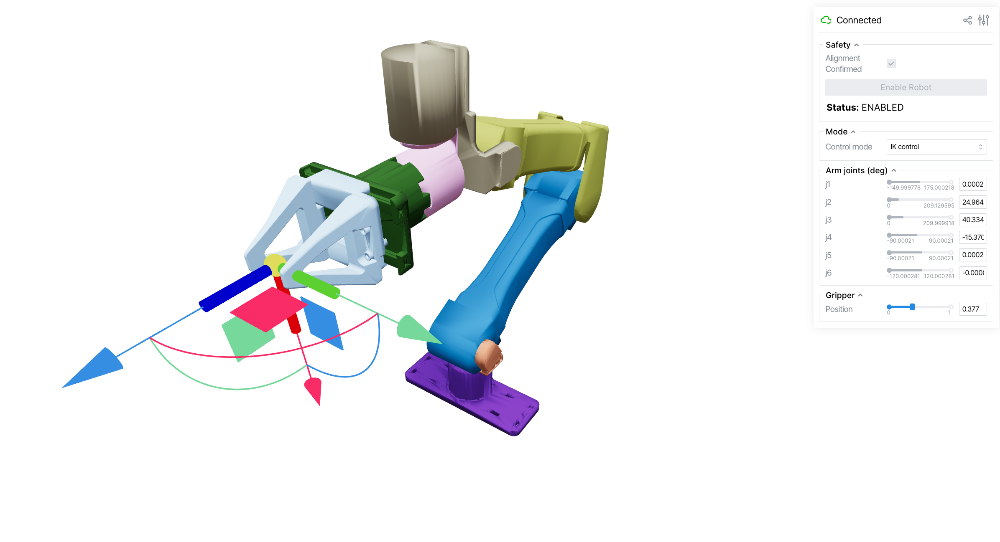

# Viser Control Interface

Browser-based 3D visualization and control interface for i2rt robots, powered by [viser](https://github.com/nerfstudio-project/viser).



## Quick Start

```bash
# Simulation mode (no hardware required)
python examples/control_with_viser/control_with_viser.py --sim

# Real robot on CAN bus
python examples/control_with_viser/control_with_viser.py --channel can0

# Specify arm and gripper variants
python examples/control_with_viser/control_with_viser.py --arm big_yam --gripper linear_4310 --sim
```

Then open `http://localhost:8080` in your browser.

## Safety Gate

The interface starts in **read-only mode**. The robot will not accept any commands until you:

1. Visually confirm that the 3D model matches the physical robot pose.
2. Check the **Alignment Confirmed** checkbox.
3. Click **Enable Robot**.

This prevents unexpected motion when the GUI is first opened.

## Control Modes

### VIS (Mirror)

Passively mirrors the robot's current joint state in the 3D viewer. No commands are sent to the robot. Joint sliders update in real time to reflect the live state. Use this mode to observe the robot without any risk of motion.

### IK Control

Drag the 6-DOF transform gizmo to command the end-effector pose. An inverse kinematics solver (via [mink](https://github.com/kevinzakka/mink)) computes the required joint angles each frame and sends them to the robot. The arm joint sliders update to reflect the solved configuration. A gripper slider is available to control the gripper independently while the arm tracks the IK target.

### Joint Sliders

Directly control each joint angle (in degrees) and the gripper position using individual sliders. Changes are sent to the robot immediately each loop iteration. This mode is useful for precise per-joint positioning and testing range of motion.

## Options

| Flag | Default | Description |
|------|---------|-------------|
| `--arm` | `yam` | Arm variant (`yam`, `yam_pro`, `yam_ultra`, `big_yam`) |
| `--gripper` | `linear_4310` | Gripper type (`linear_4310`, `linear_3507`, `crank_4310`, `no_gripper`, `yam_teaching_handle`) |
| `--channel` | `can0` | CAN interface name (ignored in sim mode) |
| `--sim` | off | Use simulated robot instead of real hardware |
| `--dt` | `0.02` | Control loop timestep in seconds |
| `--port` | `8080` | Viser server port |
| `--site` | auto | End-effector site name (auto-detected from gripper type) |
